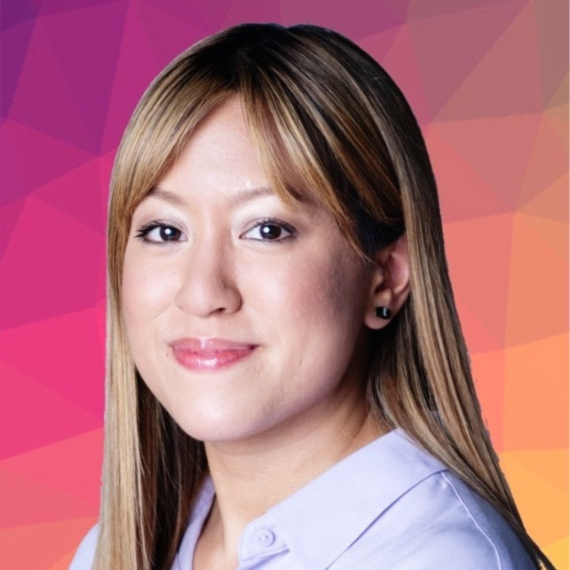

# CareBuddy, an AI Healthcare Chat Companion

CareBuddy is an AI Healthcare chat companion that can recommend lifestyle tips and nutrition recommendations for individuals seeking a healthier lifestyle.

CareBuddy tailors its responses through a conversation-like patient evaluation form to gather detailed information about the user, a chat page for seamless interaction, and a Favorites list feature that allows users to save their favorite responses.

## Watch our video to learn more about CareBuddy!

[]("CareBuddy Introduction Video")


## Table of Contents

- [Contributors](#contributors)
- [Technologies](#technologies)
- [About CareBuddy](./docs/ABOUT.md)
- [User Manual](./docs/USERMANUAL.md)
- [Developer Instructions](./docs/DEVELOPERS.md)

## Contributors

Meet the team behind CareBuddy

<table>
  <tr>
    <td align="center" width="200">
      <a href="https://www.linkedin.com/in/hamna-tameez-6495b2292/">
        <br />
        <br/>
         <br/>
        <sub><b>Hamna Tameez</b></sub>
      </a><br />
    </td>
    <td align="center" width="200">
      <a href="https://www.linkedin.com/in/christine-hoang-profile/">
        <br />
        <br/>
         <br/>
        <sub><b>Christine Hoang</b></sub>
      </a><br />
    </td>
    <td align="center" width="200">
      <a href="https://www.linkedin.com/in/aryanmurthy/">
        <br />
        <br/>
         <br/>
        <sub><b>Aryan Murthy Illa</b></sub>
      </a><br />
    </td>
    <td align="center" width="200">
      <a href="https://www.linkedin.com/in/erubal/">
        <br />
        <br/>
         <br/>
        <sub><b>Eric Rubalcaba</b></sub>
      </a><br />
    </td>
 <td align="center" width="200">
      <a href="https://www.linkedin.com/in/perumalla-litesh/">
        <br />
        <br/>
         <br/>
        <sub><b>Perumalla Litesh</b></sub>
      </a><br />
    </td>
  </tr>
</table>

## Technologies

```
Frontend Development:
    React (Javascript): Enables fast web application development while ensuring high-quality user experience
    Sass Stylesheets
    Bootstrap
    MaterialUI

Backend Development:
    Node.js: Enables server-side development for Conversation, Patient Information, and Favorites screens
    Express.js: Allows for backend logic and API services
    Axios: A reliable and simple to use web service
    Vite: A fast web application build tool that allows for rapid development

External APIs:
    OpenAI: OpenAI is integrated in the Conversation and Patient Information screens

Design and Project Management Tools:
    Figma: Utilized for UI/UX design to create a visually striking cross-platform mobile application inspired by the movie, Big Hero 6
    NotionDB: For agile project management and ticket tracking ensuring transparent work responsibiltiies and smooth development
    Prettier: Allowed for organized and structured code to improve readability and prevent merge conflicts
    Github: Used for version control to assist with code management, increase collaboration, and reduce errors by using branching strategy and performing Pull Request reviews
```


